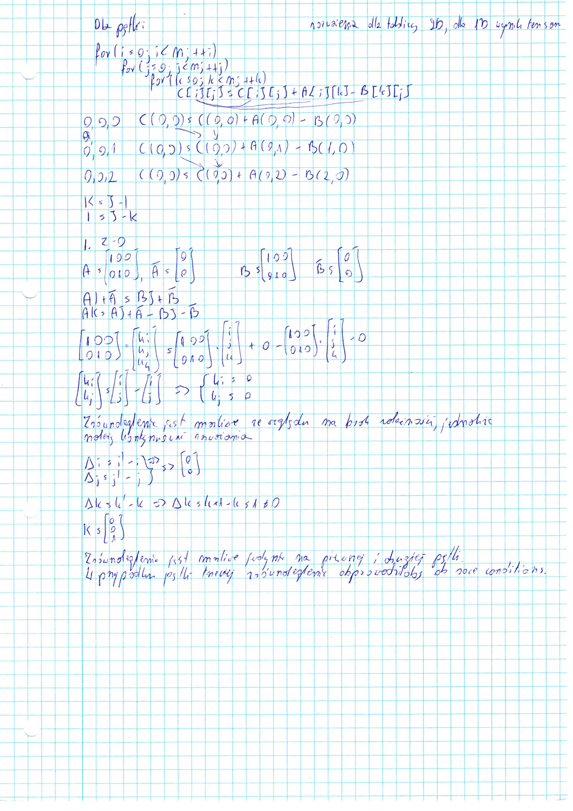

# Mnożenie macierzy

## Specyfikacja

**CPU**: AMD Ryzen™ 7 7735U with Radeon™ Graphics × 16

**RAM**: 16.0 GiB

**OS**: Fedora Linux 41 (Workstation Edition)

**Kompilator**: clang version 19.1.7

## Zrównoleglone czytanie z dysku

```cpp
Matrix m1, m2;
#pragma omp parallel sections
{
#pragma omp section
  {
    m1 = matrix_read(in1);
  }
#pragma omp section
  {
    m2 = matrix_read(in2);
  }
}
```

## Zrównoleglenia pętli

Zrównoleglenie po trzeciej pętli zwraca niepoprawne wyniki.
Zrównoleglenie trzeciej pętli w algorytmie prowadzi do nieprawidłowych wyników
z powodu race conditions. Wiele wątków jednocześnie próbuje aktualizować ten sam
element macierzy wynikowej `m.items` bez synchronizacji,
powodując race conditions, a tym samym nieprawidłowe wyniki.

- `MATRIX_PARALLELIZE_FIRST` i `MATRIX_PARALLELIZE_SECOND` zrównoleglają
odpowiednio zewnętrzną i środkową pętlę,
które rozdzielają pracę między wątki bez race conditions.
- `MATRIX_PARALLELIZE_THIRD` zrównolegla najbardziej wewnętrzną pętlę,
co prowadzi do jednoczesnej aktualizacji tego samego elementu
`m.items[i * m.cols + j]` przez wiele wątków.

## Tabela czasów

> Mierzenie czasu (main.cpp)

```cpp
double start = omp_get_wtime();
const Matrix m3 = matrix_multiply(&m1, &m2);
std::cout << "Multiplication time: " << omp_get_wtime() - start << "s\n";
```

### Zrównoleglona pierwsza pętla (nieznacznie wydajniejsza)

| Rozmiar | Sek.       | 2          | 4          | 8           | 16           |
| ------- | ---------- | ---------- | ---------- | ----------- | ------------ |
| 100     | 0.00464511 | 0.00305486 | 0.00205779 | 0.00184894  | 0.00247097   |
| 500     | 0.429552   | 0.228534   | 0.119312   | 0.10316     | 0.0613549    |
| 1000    | 3.50236    | 1.79631    | 0.946576   | **0.53452** | **0.523507** |
| 2000    | 34.7186    | 18.0619    | 9.39324    | **5.21831** | **4.90127**  |

> matrix.cpp

```cpp
#ifdef MATRIX_PARALLELIZE_FIRST
#pragma omp parallel for
#endif
  for (uint16_t i = 0; i < m1->rows; ++i) {
    for (uint16_t j = 0; j < m2->cols; ++j) {
      for (uint16_t k = 0; k < m1->cols; ++k) {
        m.items[i * m.cols + j] +=
            m1->items[i * m1->cols + k] * m2->items[k * m2->cols + j];
      }
    }
  }
```

### Zrównoleglona druga pętla

| Rozmiar | Sek.       | 2          | 4          | 8            | 16           |
| ------- | ---------- | ---------- | ---------- | ------------ | ------------ |
| 100     | 0.004884   | 0.00382996 | 0.00228691 | 0.00237513   | 0.00300694   |
| 500     | 0.431423   | 0.22843    | 0.121885   | 0.066236     | 0.115295     |
| 1000    | 3.56473    | 1.86065    | 0.974723   | **0.628134** | **0.656047** |
| 2000    | 34.8433    | 17.8441    | 9.41069    | **5.38997**  | **6.14923**  |

> matrix.cpp

```cpp
  for (uint16_t i = 0; i < m1->rows; ++i) {
#ifdef MATRIX_PARALLELIZE_SECOND
#pragma omp parallel for
#endif
    for (uint16_t j = 0; j < m2->cols; ++j) {
      for (uint16_t k = 0; k < m1->cols; ++k) {
        m.items[i * m.cols + j] +=
            m1->items[i * m1->cols + k] * m2->items[k * m2->cols + j];
      }
    }
  }
```

## Badania dla zrównoleglonej pierwszej pętli

### Schedule static

| Fragment | Rozmiar | 8        | 16       |
| -------- | ------- | -------- | -------- |
| 10       | 1000    | 0.586705 | 0.55614  |
| 10       | 2000    | 5.10526  | 5.20989  |
| 50       | 1000    | 0.623414 | 0.703368 |
| 50       | 2000    | 5.11087  | 4.86923  |
| 100      | 1000    | 0.802295 | 0.728099 |
| 100      | 2000    | 6.03135  | 5.7758   |

> matrix.cpp

```cpp
#ifdef MATRIX_PARALLELIZE_FIRST
#pragma omp parallel for schedule(static, 100)
#endif
  for (uint16_t i = 0; i < m1->rows; ++i) {
    for (uint16_t j = 0; j < m2->cols; ++j) {
      for (uint16_t k = 0; k < m1->cols; ++k) {
        m.items[i * m.cols + j] +=
            m1->items[i * m1->cols + k] * m2->items[k * m2->cols + j];
      }
    }
  }
```

### Schedule dynamic

| Fragment | Rozmiar | 8        | 16       |
| -------- | ------- | -------- | -------- |
| 10       | 1000    | 0.598091 | 0.530066 |
| 10       | 2000    | 5.92392  | 4.86848  |
| 50       | 1000    | 0.621086 | 0.706843 |
| 50       | 2000    | 5.19588  | 5.04123  |
| 100      | 1000    | 0.843801 | 0.725773 |
| 100      | 2000    | 6.08794  | 5.79966  |

> matrix.cpp

```cpp
#ifdef MATRIX_PARALLELIZE_FIRST
#pragma omp parallel for schedule(dynamic, 100)
#endif
  for (uint16_t i = 0; i < m1->rows; ++i) {
    for (uint16_t j = 0; j < m2->cols; ++j) {
      for (uint16_t k = 0; k < m1->cols; ++k) {
        m.items[i * m.cols + j] +=
            m1->items[i * m1->cols + k] * m2->items[k * m2->cols + j];
      }
    }
  }
```

### Schedule guided

| Fragment | Rozmiar | 8        | 16       |
| -------- | ------- | -------- | -------- |
| 10       | 1000    | 0.590611 | 0.543017 |
| 10       | 2000    | 5.19615  | 4.83037  |
| 50       | 1000    | 0.621673 | 0.660162 |
| 50       | 2000    | 5.46533  | 5.16736  |
| 100      | 1000    | 0.815689 | 0.730184 |
| 100      | 2000    | 6.09648  | 5.87968  |

> matrix.cpp

```cpp
#ifdef MATRIX_PARALLELIZE_FIRST
#pragma omp parallel for schedule(guided, 100)
#endif
  for (uint16_t i = 0; i < m1->rows; ++i) {
    for (uint16_t j = 0; j < m2->cols; ++j) {
      for (uint16_t k = 0; k < m1->cols; ++k) {
        m.items[i * m.cols + j] +=
            m1->items[i * m1->cols + k] * m2->items[k * m2->cols + j];
      }
    }
  }
```

## Analiza zależności


